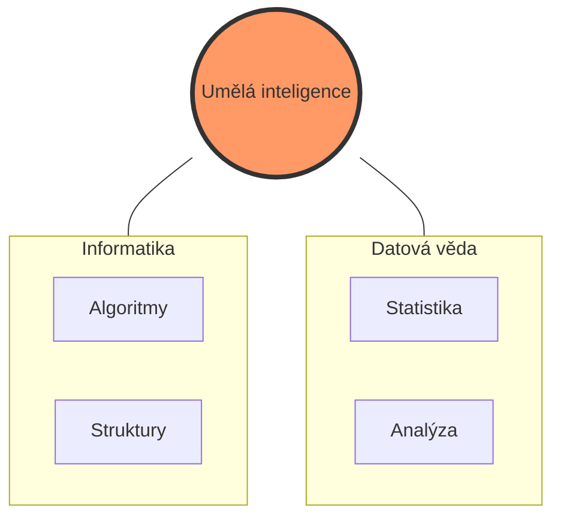
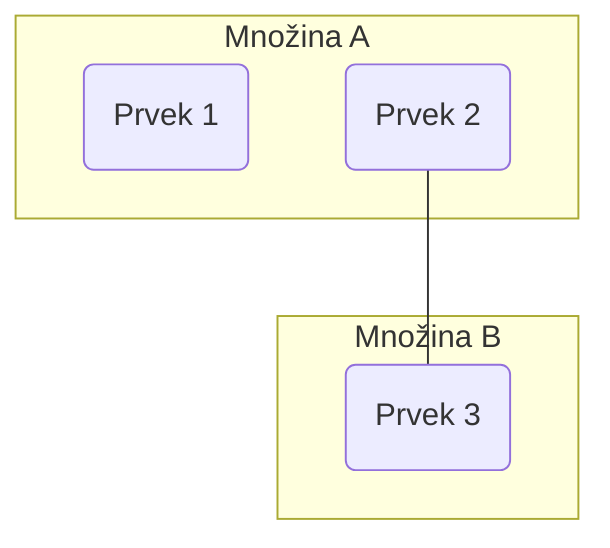

Computer Science
- Artificial Intelligence
  - Machine Learning
    - Deep Learning
```d2
Computer Science: {
  Artificial Intelligence: {
    Machine Learning: {
      Deep Learning
    }
  }
}
Data Science: {
  Machine Learning
}
```


   
informatika
- umělá inteligence
  - strojové učení
    - hluboké učení


