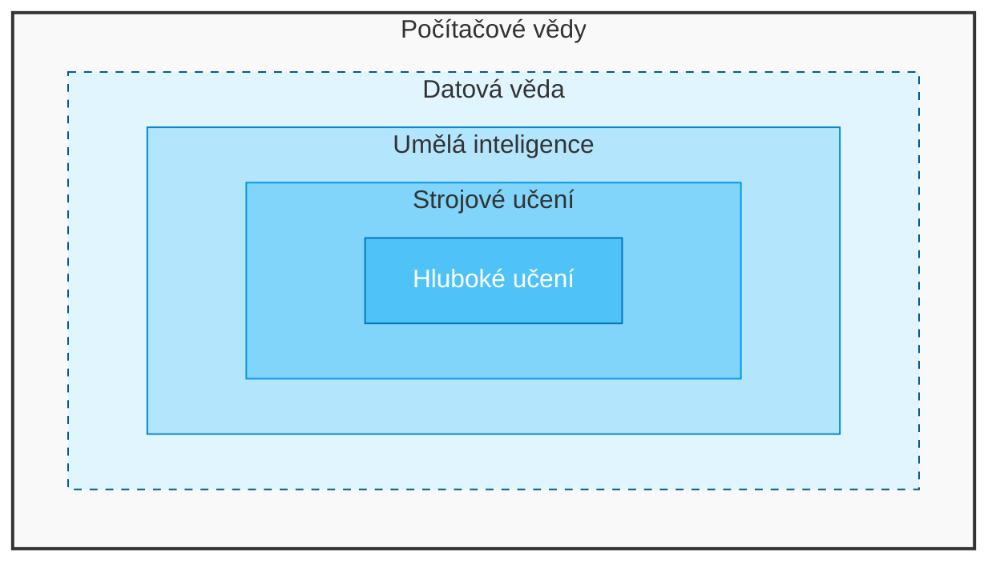
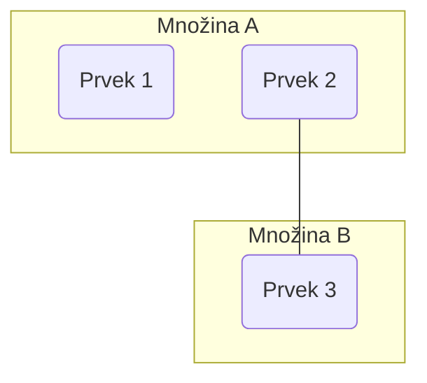

Computer Science
- Artificial Intelligence
  - Machine Learning
    - Deep Learning

```mermaid
graph BT
    subgraph ComputerScience [Počítačové vědy]
        subgraph DataScience [Datová věda]
            subgraph AI [Umělá inteligence]
                subgraph ML [Strojové učení]
                    DL[Hluboké učení]
                end
            end
        end
    end

    %% Stylizace pro lepší přehlednost
    style ComputerScience fill:#f9f9f9,stroke:#333,stroke-width:2px
    style DataScience fill:#e1f5fe,stroke:#01579b,stroke-dasharray: 5 5
    style AI fill:#b3e5fc,stroke:#0288d1
    style ML fill:#81d4fa,stroke:#039be5
    style DL fill:#4fc3f7,stroke:#0277bd,color:#fff
```
   
informatika
- umělá inteligence
  - strojové učení
    - hluboké učení

```mermaid
graph TD
    subgraph Množina A
    A1(Prvek 1)
    A2(Prvek 2)
    end
    subgraph Množina B
    B1(Prvek 3)
    end
    A2 --- B1
```
