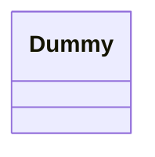

## Účel

Zabraňuje svázání odesílatele požadavku s jeho příjemcem tím, že dává více než jednomu objektu šanci požadavek zpracovat. Objekty příjemců jsou zřetězeny a požadavek je předáván po řetězci, dokud jej některý objekt nezpracuje.

## Motivace

Představme si kontextově citlivý systém nápovědy pro grafické uživatelské rozhraní. Uživatel může získat informace o nápovědě k jakékoli části rozhraní pouhým kliknutím na ni. Poskytovaná nápověda závisí na vybrané části rozhraní a jejím kontextu; například widget tlačítka v dialogovém okně může mít jiné informace o nápovědě než podobné tlačítko v hlavním okně. Pokud pro danou část rozhraní neexistují žádné specifické informace o nápovědě, pak by systém nápovědy měl zobrazit obecnější zprávu o nápovědě týkající se bezprostředního kontextu – například celého dialogového okna.

Proto je přirozené organizovat informace o nápovědě podle jejich obecnosti – od nejkonkrétnějších po nejobecnější. Dále je zřejmé, že požadavek na nápovědu je zpracováván jedním z několika objektů uživatelského rozhraní; který z nich, závisí na kontextu a na tom, jak specifická je dostupná nápověda.

Problém je v tom, že objekt, který nakonec poskytuje nápovědu, není explicitně znám objektu (např. tlačítku), který inicializuje požadavek na nápovědu. Potřebujeme způsob, jak oddělit tlačítko, které inicializuje požadavek na nápovědu, od objektů, které by mohly poskytnout informace o nápovědě. Vzor Řetězec zodpovědnosti definuje, jak se to děje.

Myšlenkou tohoto vzoru je oddělit odesílatele a příjemce tím, že se několika objektům dá šance zpracovat požadavek. Požadavek je předáván po řetězci objektů, dokud ho některý z nich nezpracuje.



První objekt v řetězci obdrží požadavek a buď jej zpracuje, nebo jej předá dalšímu kandidátovi v řetězci, který učiní totéž. Objekt, který požadavek odeslal, nemá explicitní znalost o tom, kdo jej zpracuje – říkáme, že požadavek má implicitního příjemce.

Předpokládejme, že uživatel klikne pro nápovědu na widget tlačítka označeného „Tisk“. Tlačítko je obsaženo v instanci PrintDialog, která zná objekt aplikace, do které patří (viz předchozí objektový diagram). Následující interakční diagram ilustruje, jak se požadavek na nápovědu předává po řetězci:


V tomto případě požadavek nezpracuje ani aPrintButton, ani aPrintDialog; zastaví se u anApplication, které jej může zpracovat nebo ignorovat. Klient, který požadavek vydal, nemá přímý odkaz na objekt, který jej nakonec splní.

Pro předávání požadavku po řetězci a zajištění, že příjemci zůstanou implicitní, sdílí každý objekt v řetězci společné rozhraní pro zpracování požadavků a pro přístup k jeho nástupci v řetězci. Například systém nápovědy by mohl definovat třídu HelpHandler s odpovídající operací HandleHelp. HelpHandler může být nadřazenou třídou pro třídy kandidátních objektů, nebo může být definována jako mixin třída. Poté třídy, které chtějí zpracovávat požadavky na nápovědu, mohou mít HelpHandler jako rodiče:


Třídy Button, Dialog a Application používají operace HelpHandler pro zpracování požadavků na nápovědu. Operace HandleHelp třídy HelpHandler ve výchozím nastavení předává požadavek nástupci. Podtřídy mohou tuto operaci přepsat, aby poskytly nápovědu za správných okolností; jinak mohou použít výchozí implementaci k předání požadavku.

## Použitelnost

Řetězec zodpovědnosti použijte, když

- požadavek může zpracovat více než jeden objekt a jeho zpracovatel není předem znám. Zpracovatel by měl být zjištěn automaticky.
- chcete vydat požadavek na jeden z několika objektů, aniž byste explicitně specifikovali příjemce.
- sada objektů, které mohou zpracovat požadavek, by měla být specifikována dynamicky.

## Struktura


Typická struktura objektů může vypadat takto:


## Účastníci

- **Handler** (HelpHandler)
  - definuje rozhraní pro zpracování požadavků.
  - (volitelně) implementuje odkaz na nástupce.
- **ConcreteHandler** (PrintButton, PrintDialog)
  - zpracovává požadavky, za které je zodpovědný.
  - má přístup ke svému nástupci.
  - pokud ConcreteHandler může požadavek zpracovat, učiní tak; jinak požadavek předá svému nástupci.
- **Client**
  - inicializuje požadavek na objekt ConcreteHandler v řetězci.

## Spolupráce

- Když klient vydá požadavek, požadavek se šíří po řetězci, dokud objekt ConcreteHandler nepřevezme odpovědnost za jeho zpracování.

## Důsledky

Řetězec zodpovědnosti má následující výhody a nevýhody:

1. Snížené provázání. Vzor uvolňuje objekt od znalosti, který jiný objekt zpracovává požadavek. Objekt musí pouze vědět, že požadavek bude zpracován „vhodně“. Příjemce i odesílatel o sobě navzájem nemají žádné explicitní znalosti a objekt v řetězci nemusí znát strukturu řetězce.

Výsledkem je, že Řetězec zodpovědnosti může zjednodušit propojení objektů. Namísto toho, aby objekty udržovaly odkazy na všechny kandidátní příjemce, udržují jediný odkaz na svého nástupce.
2. Přidaná flexibilita při přidělování zodpovědností objektům. Řetězec zodpovědnosti vám poskytuje větší flexibilitu při distribuci zodpovědností mezi objekty. Můžete přidávat nebo měnit zodpovědnosti za zpracování požadavku přidáním nebo jinou změnou řetězce za běhu. To lze kombinovat s podtřídami k statické specializaci zpracovatelů.
3. Zpracování není zaručeno. Jelikož požadavek nemá explicitního příjemce, není zaručeno, že bude zpracován – požadavek může spadnout z konce řetězce, aniž by byl kdy zpracován. Požadavek může zůstat nezpracován i v případě, že řetězec není správně nakonfigurován.

## Implementace

Zde jsou problémy implementace, které je třeba zvážit u Řetězce zodpovědnosti:

1. *Implementace řetězce nástupců.* Existují dva možné způsoby implementace řetězce nástupců:
    (a) Definujte nové odkazy (obvykle v Handleru, ale ConcreteHandlers by je mohly definovat místo toho).
    (b) Použijte existující odkazy.
  Naše příklady zatím definují nové odkazy, ale často můžete použít existující reference na objekty k vytvoření řetězce nástupců. Například reference na rodiče v hierarchii část-celek mohou definovat nástupce části. Struktura widgetů již takové odkazy může mít. Kompozit (163) podrobněji pojednává o referencích na rodiče.

  Použití existujících odkazů funguje dobře, když odkazy podporují řetězec, který potřebujete. Ušetří vám to explicitní definování odkazů a ušetří místo. Pokud však struktura neodráží řetězec zodpovědnosti, který vaše aplikace vyžaduje, pak budete muset definovat redundantní odkazy.
2. *Propojování nástupců.* Pokud neexistují žádné předem existující reference pro definování řetězce, pak je budete muset zavést sami. V takovém případě Handler nejen definuje rozhraní pro požadavky, ale obvykle také udržuje nástupce. To umožňuje handleru poskytnout výchozí implementaci HandleRequest, která předá požadavek nástupci (pokud existuje). Pokud podtřída ConcreteHandler nemá zájem o požadavek, nemusí přepisovat operaci předávání, protože její výchozí implementace předává bezpodmínečně.

  Zde je základní třída HelpHandler, která udržuje odkaz na nástupce:

  ```cpp
  class HelpHandler {
  public:
      HelpHandler(HelpHandler* s) : _successor(s) { }
      virtual void HandleHelp();
  private:
      HelpHandler* _successor;
  };
  void HelpHandler::HandleHelp () {
      if (_successor) {
          _successor->HandleHelp();
      }
  }
    ```
3. *Reprezentace požadavků.* Pro reprezentaci požadavků jsou k dispozici různé možnosti. V nejjednodušší formě je požadavek pevně zakódované volání operace, jako v případě HandleHelp. To je pohodlné a bezpečné, ale můžete předávat pouze pevně definovanou sadu požadavků, které definuje třída Handler.

Alternativou je použití jedné obslužné funkce, která jako parametr přebírá kód požadavku (např. celočíselnou konstantu nebo řetězec). To podporuje otevřenou sadu požadavků. Jediným požadavkem je, aby se odesílatel a příjemce dohodli na tom, jak by měl být požadavek kódován.

Tento přístup je flexibilnější, ale vyžaduje podmíněné příkazy pro odesílání požadavku na základě jeho kódu. Navíc neexistuje typově bezpečný způsob předávání parametrů, takže je nutné je ručně balit a rozbalovat. To je samozřejmě méně bezpečné než přímé volání operace.

K řešení problému předávání parametrů můžeme použít samostatné objekty požadavků, které sdružují parametry požadavku. Třída Request může explicitně reprezentovat požadavky a nové typy požadavků mohou být definovány pomocí podtříd. Podtřídy mohou definovat různé parametry. Handlery musí znát typ požadavku (tj. kterou podtřídu Request používají), aby měly přístup k těmto parametrům.

Pro identifikaci požadavku může Request definovat přístupovou funkci, která vrací identifikátor třídy. Alternativně může příjemce použít informace o typu za běhu, pokud to implementační jazyk podporuje.

Zde je náčrt dispečerské funkce, která používá objekty požadavků k identifikaci požadavků. Operace GetKind definovaná v základní třídě Request identifikuje typ požadavku:

```cpp
void Handler::HandleRequest (Request* theRequest) {
    switch (theRequest->GetKind()) {
    case Help:
        // přetypování argumentu na vhodný typ
        HandleHelp((HelpRequest*) theRequest);
        break;
    case Print:
        HandlePrint((PrintRequest*) theRequest);
        // ...
        break;
    default:
        // ...
        break;
    }
}
```

Podtřídy mohou rozšířit odesílání přepsáním HandleRequest. Podtřída zpracovává pouze požadavky, o které má zájem; ostatní požadavky jsou předány nadřazené třídě. Tímto způsobem podtřídy efektivně rozšiřují (namísto přepisování) operaci HandleRequest. Například takto podtřída ExtendedHandler rozšiřuje verzi HandleRequest třídy Handler:

```cpp
class ExtendedHandler : public Handler {
public:
    virtual void HandleRequest(Request* theRequest);
    // ...
};
void ExtendedHandler::HandleRequest (Request* theRequest) {
    switch (theRequest->GetKind()) {
    case Preview:
        // zpracování požadavku Preview
        break;
    default:
        // nechat Handler zpracovat ostatní požadavky
        Handler::HandleRequest(theRequest);
    }
}
```

*Automatické předávání ve Smalltalku.* Pro předávání požadavků můžete ve Smalltalku použít mechanismus `doesNotUnderstand`. Zprávy, které nemají odpovídající metody, jsou zachyceny v implementaci `doesNotUnderstand`, kterou lze přepsat pro předání zprávy nástupci objektu. Není tedy nutné implementovat předávání ručně; třída zpracovává pouze požadavek, o který má zájem, a spoléhá se na `doesNotUnderstand`, že předá všechny ostatní.

## Ukázkový kód

Následující příklad ilustruje, jak řetězec zodpovědnosti může zpracovávat požadavky na online systém nápovědy, jako je ten popsaný dříve. Požadavek na nápovědu je explicitní operace. Použijeme existující reference na rodiče v hierarchii widgetů pro šíření požadavků mezi widgety v řetězci, a definujeme referenci ve třídě Handler pro šíření požadavků na nápovědu mezi ne-widgety v řetězci.

Třída HelpHandler definuje rozhraní pro zpracování požadavků na nápovědu. Udržuje téma nápovědy (které je ve výchozím nastavení prázdné) a udržuje odkaz na svého nástupce v řetězci obsluh nápovědy. Klíčovou operací je HandleHelp, kterou podtřídy přepisují. HasHelp je pomocná operace pro kontrolu, zda existuje přidružené téma nápovědy.

```cpp
typedef int Topic;
const Topic NO_HELP_TOPIC = -1;
class HelpHandler {
public:
    HelpHandler(HelpHandler* = 0, Topic = NO_HELP_TOPIC);
    virtual bool HasHelp();
    virtual void SetHandler(HelpHandler*, Topic);
    virtual void HandleHelp();
private:
    HelpHandler* _successor;
    Topic _topic;
};
HelpHandler::HelpHandler (
    HelpHandler* h, Topic t
) : _successor(h), _topic(t) { }
bool HelpHandler::HasHelp () {
    return _topic != NO_HELP_TOPIC;
}
void HelpHandler::HandleHelp () {
    if (_successor != 0) {
        _successor->HandleHelp();
    }
}
```

Všechny widgety jsou podtřídami abstraktní třídy Widget. Widget je podtřídou HelpHandler, protože všechny prvky uživatelského rozhraní mohou mít k sobě přidruženou nápovědu. (Stejně tak bychom mohli použít implementaci založenou na mixinu.)

```cpp
class Widget : public HelpHandler {
protected:
    Widget(Widget* parent, Topic t = NO_HELP_TOPIC);
private:
    Widget* _parent;
};
Widget::Widget (Widget* w, Topic t) : HelpHandler(w, t) {
    _parent = w;
}
```

V našem příkladu je tlačítko prvním obslužným prvkem v řetězci. Třída Button je podtřídou Widget. Konstruktor tlačítka přebírá dva parametry: odkaz na jeho obklopující widget a téma nápovědy.

```cpp
class Button : public Widget {
public:
    Button(Widget* d, Topic t = NO_HELP_TOPIC);
    virtual void HandleHelp();
    // Operace Widget, které Button přepisuje...
};
```

Verze HandleHelp třídy Button nejprve zkontroluje, zda existuje téma nápovědy pro tlačítka. Pokud vývojář žádné nedefinoval, požadavek se předá nástupci pomocí operace HandleHelp ve třídě HelpHandler. Pokud téma nápovědy existuje, tlačítko jej zobrazí a hledání končí.

```cpp
Button::Button (Widget* h, Topic t) : Widget(h, t) { }
void Button::HandleHelp () {
    if (HasHelp()) {
        // nabídnout nápovědu k tlačítku
    } else {
        HelpHandler::HandleHelp();
    }
}
```

Dialog implementuje podobné schéma, s tím rozdílem, že jeho nástupcem není widget, ale jakýkoli obslužný prvek nápovědy. V naší aplikaci bude tímto nástupcem instance aplikace.

```cpp
class Dialog : public Widget {
public:
    Dialog(HelpHandler* h, Topic t = NO_HELP_TOPIC);
    virtual void HandleHelp();
    // Operace Widget, které Dialog přepisuje...
    // ...
};

Dialog::Dialog (HelpHandler* h,  Topic t) : Widget(0) {
    SetHandler(h, t);
}

void Dialog::HandleHelp () {
    if (HasHelp()) {
        // nabídnout nápovědu k dialogu
    } else {
        HelpHandler::HandleHelp();
    }
}
```

Na konci řetězce je instance aplikace. Aplikace není widget, takže Application je přímo podtřídou HelpHandler. Když se požadavek na nápovědu rozšíří na tuto úroveň, aplikace může poskytnout informace o aplikaci obecně, nebo může nabídnout seznam různých témat nápovědy:

```cpp
class Application : public HelpHandler {
public:
    Application(Topic t) : HelpHandler(0, t) { }
    virtual void HandleHelp();
    // Operace specifické pro aplikaci...
};
void Application::HandleHelp () {
    // zobrazit seznam témat nápovědy
}
```

Následující kód vytváří a propojuje tyto objekty. Zde se dialog týká tisku, a tak mají objekty přiřazena témata související s tiskem.

```cpp
const Topic PRINT_TOPIC = 1;
const Topic PAPER_ORIENTATION_TOPIC = 2;
const Topic APPLICATION_TOPIC = 3;
Application* application = new Application(APPLICATION_TOPIC);
Dialog* dialog = new Dialog(application, PRINT_TOPIC);
Button* button = new Button(dialog, PAPER_ORIENTATION_TOPIC);
```

Požadavek na nápovědu můžeme vyvolat voláním HandleHelp na libovolném objektu v řetězci. Chcete-li spustit hledání u objektu tlačítka, stačí na něj zavolat HandleHelp:

```cpp
button->HandleHelp();
```

V tomto případě tlačítko požadavek okamžitě zpracuje. Všimněte si, že jakákoli třída HelpHandler by se mohla stát nástupcem dialogu. Navíc by se její nástupce mohl dynamicky měnit. Takže bez ohledu na to, kde je dialog použit, získáte pro něj správné kontextově závislé informace o nápovědě.

## Známé použití

Několik třídních knihoven používá vzor Řetězec zodpovědnosti pro zpracování uživatelských událostí. Používají různé názvy pro třídu Handler, ale myšlenka je stejná: Když uživatel klikne myší nebo stiskne klávesu, vygeneruje se událost a předá se po řetězci. MacApp [App89] a ET++ [WGM88] ji nazývají „Event-Handler“, knihovna TCL od Symantecu [Sym93b] ji nazývá „Bureaucrat“ a AppKit od NeXT [Add94] používá název „Responder“.

Framework Unidraw pro grafické editory definuje objekty Command, které zapouzdřují požadavky na objekty Component a Component View [VL90]. Příkazy jsou požadavky v tom smyslu, že komponenta nebo zobrazení komponenty může interpretovat příkaz k provedení operace. To odpovídá přístupu „požadavky jako objekty“ popsanému v Implementaci. Komponenty a zobrazení komponent mohou být hierarchicky strukturovány. Komponenta nebo zobrazení komponenty může předat interpretaci příkazu svému rodiči, který ji zase může předat svému rodiči a tak dále, čímž se vytvoří řetězec zodpovědnosti.

ET++ používá Řetězec zodpovědnosti pro zpracování grafické aktualizace. Grafický objekt volá operaci InvalidateRect, kdykoli musí aktualizovat část svého vzhledu. Grafický objekt nemůže InvalidateRect zpracovat sám, protože nemá dostatek informací o svém kontextu. Například grafický objekt může být obklopen objekty jako Scrollers nebo Zoomers, které transformují jeho souřadnicový systém. To znamená, že objekt může být posunut nebo zvětšen tak, že je částečně mimo zobrazení. Proto výchozí implementace InvalidateRect předá požadavek obklopujícímu kontejnerovému objektu. Posledním objektem v řetězci předávání je instance Window. V době, kdy Window obdrží požadavek, je zaručeno, že obdélník zneplatnění je správně transformován. Window zpracovává InvalidateRect oznámením rozhraní okenního systému a vyžádáním aktualizace.

## Související vzory

Řetězec zodpovědnosti je často aplikován ve spojení s Kompozitem (163). Tam může rodič komponenty fungovat jako její nástupce.
