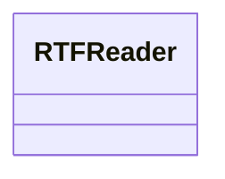
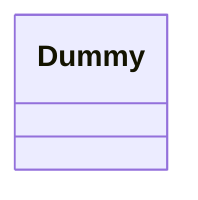

## Záměr

Oddělit konstrukci komplexního objektu od jeho reprezentace tak, aby stejný proces konstrukce mohl vytvářet různé reprezentace.

## Motivace

Čtečka pro formát výměny dokumentů RTF (Rich Text Format) by měla být schopna převést RTF do mnoha textových formátů. Čtečka by mohla převést dokumenty RTF do prostého textu ASCII nebo do textového widgetu, který lze interaktivně upravovat. Problém je však v tom, že počet možných konverzí je neomezený. Proto by mělo být snadné přidat novou konverzi bez úpravy čtečky.

Řešením je konfigurace třídy RTFReader s objektem TextConverter, který převádí RTF do jiné textové reprezentace. Jakmile RTFReader analyzuje dokument RTF, použije k provedení konverze objekt TextConverter. Kdykoli RTFReader rozpozná RTF token (buď prostý text, nebo řídicí slovo RTF), vydá požadavek na TextConverter o převod tokenu. Objekty TextConverter jsou zodpovědné jak za provedení převodu dat, tak za reprezentaci tokenu v určitém formátu.

Podtřídy TextConverter se specializují na různé převody a formáty. Například ASCIIConverter ignoruje požadavky na převod čehokoli kromě prostého textu. TeXConverter na druhou stranu implementuje operace pro všechny požadavky, aby vytvořil reprezentaci TEX, která zachycuje všechny stylistické informace v textu. TextWidgetConverter vytvoří komplexní objekt uživatelského rozhraní, který umožňuje uživateli zobrazit a upravovat text.



Každý typ třídy převodníku přebírá mechanismus pro vytváření a sestavování komplexního objektu a umisťuje ho za abstraktní rozhraní. Převodník je oddělen od čtečky, která je zodpovědná za analýzu dokumentu RTF.

Vzor Builder zachycuje všechny tyto vztahy. Každá třída převodníku se ve vzoru nazývá builder a čtečka se nazývá director. V tomto příkladu vzor Builder odděluje algoritmus pro interpretaci textového formátu (tj. analyzátor pro dokumenty RTF) od toho, jak je převedený formát vytvořen a reprezentován. To nám umožňuje znovu použít parsovací algoritmus RTFReaderu k vytvoření různých textových reprezentací z dokumentů RTF – stačí nakonfigurovat RTFReader s různými podtřídami TextConverteru.

## Použitelnost

Použijte vzor Builder, když

- algoritmus pro vytvoření komplexního objektu by měl být nezávislý na částech, které tvoří objekt, a na tom, jak jsou sestaveny.
- proces konstrukce musí umožňovat různé reprezentace pro konstruovaný objekt.

## Struktura

```mořská panna
třídaDiagram
směr TD

třída Director {
}
```

## Účastníci

- Builder (TextConverter)
- určuje abstraktní rozhraní pro vytváření částí objektu Product.

- ConcreteBuilder (ASCIIText, TeXConverter, TextWidgetConverter)
- konstruuje a sestavuje části produktu implementací rozhraní Builder.
- definuje a sleduje reprezentaci, kterou vytváří.
- poskytuje rozhraní pro načtení produktu (např. GetASCIIText, Get-Text Widget).
- Director (RTFReader)
- konstruuje objekt pomocí rozhraní Builder.
- Product (ASCIIText, TeXText, TextWidget)
- reprezentuje komplexní objekt ve výstavbě. ConcreteBuilder sestavuje interní reprezentaci produktu a definuje proces, kterým je sestavován.
- obsahuje třídy, které definují jednotlivé části, včetně rozhraní pro sestavování částí do konečného výsledku.

## Spolupráce

- Klient vytvoří objekt Director a nakonfiguruje jej s požadovaným objektem Builder.
- Director upozorní tvůrce, kdykoli by měla být sestavena část produktu.
- Builder zpracovává požadavky od Director a přidává části do produktu.
- Klient načte produkt z nástroje pro tvorbu.

Následující interakční diagram ilustruje, jak nástroje pro tvorbu a Director spolupracují s klientem.



## Důsledky

Zde jsou klíčové důsledky vzoru Builder:

1. *Umožňuje měnit vnitřní reprezentaci produktu.* Objekt Builder poskytuje nástroji pro tvorbu abstraktní rozhraní pro konstrukci produktu. Rozhraní umožňuje nástroji pro tvorbu skrýt reprezentaci a vnitřní strukturu produktu. Také skrývá, jak je produkt sestaven. Protože je produkt konstruován prostřednictvím abstraktního rozhraní, stačí pro změnu vnitřní reprezentace produktu definovat nový typ nástroje pro tvorbu.

2. *Izoluje kód pro konstrukci a reprezentaci.* Vzor Builder zlepšuje modularitu zapouzdřením způsobu, jakým je komplexní objekt konstruován a reprezentován. Klienti nemusí vědět nic o třídách, které definují produkty v