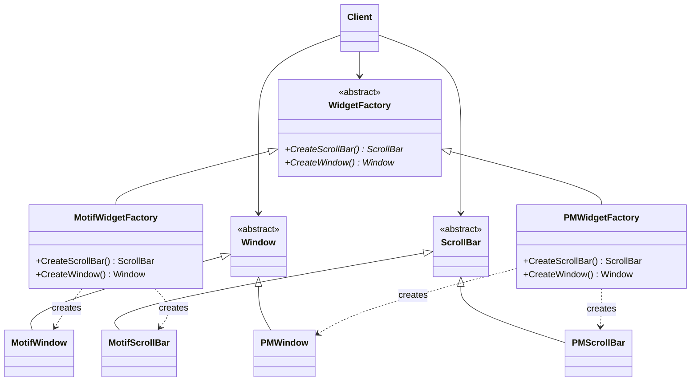
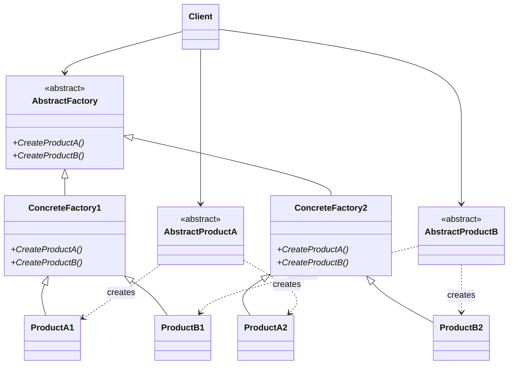

# Object Creational: Abstract Factory

## Intent
Provide an interface for creating families of related or dependent objects without specifying their concrete classes.

## Also Known As
Kit

## Motivation

Consider a user interface toolkit that supports multiple look-and-feel standards, such as Motif and Presentation Manager. Different look-and-feels define different appearances and behaviors for user interface “widgets” like scroll bars, windows, and buttons. To be portable across look-and-feel standards, an application should not hard-code its widgets for a particular look and feel. Instantiating look-and-feel-specific classes of widgets throughout the application makes it hard to change the look and feel later.

We can solve this problem by defining an abstract WidgetFactory class that declares an interface for creating each basic kind of widget. There’s also an abstract class for each kind of widget, and concrete subclasses implement widgets for specific look-and-feel standards. WidgetFactory’s interface has an operation that returns a new widget object for each abstract widget class. Clients call these operations to obtain widget instances, but clients aren’t aware of the concrete classes they’re using. Thus clients stay independent of the prevailing look and feel.



There is a concrete subclass of WidgetFactory for each look-and-feel standard. Each subclass implements the operations to create the appropriate widget for the look and feel. For example, the CreateScrollBar operation on the MotifWidgetFactory instantiates and returns a Motif scroll bar, while the corresponding operation on the PMWidgetFactory returns a scroll bar for Presentation Manager. Clients create widgets solely through the WidgetFactory interface and have no knowledge of the classes that implement widgets for a particular look and feel. In other words, clients only have to commit to an interface defined by an abstract class, not a particular concrete class.

A WidgetFactory also enforces dependencies between the concrete widget classes. A Motif scroll bar should be used with a Motif button and a Motif text editor, and that constraint is enforced automatically as a consequence of using a MotifWidgetFactory.

## Applicability
Use the Abstract Factory pattern when
+ a system should be independent of how its products are created, composed, and represented.
+ a system should be configured with one of multiple families of products.
+ a family of related product objects is designed to be used together, and you need to enforce this constraint.
+ you want to provide a class library of products, and you want to reveal just their interfaces, not their implementations.

## Structure



## Participants
+ **AbstractFactory** (WidgetFactory)
    - declares an interface for operations that create abstract product objects.
+ **ConcreteFactory** (MotifWidgetFactory, PMWidgetFactory)
    - implements the operations to create concrete product objects.
+ **AbstractProduct** (Window, ScrollBar)
    - declares an interface for a type of product object.
+ **ConcreteProduct** (MotifWindow, MotifScrollBar)
    - defines a product object to be created by the corresponding concrete factory.
    - implements the AbstractProduct interface.
+ **Client**
    - uses only interfaces declared by AbstractFactory and AbstractProduct classes.

## Collaborations
+ Normally a single instance of a ConcreteFactory class is created at run-time. This concrete factory creates product objects having a particular implementation. To create different product objects, clients should use a different concrete factory.
+ AbstractFactory defers creation of product objects to its ConcreteFactory subclass.

## Consequences
The Abstract Factory pattern has the following benefits and liabilities:
1. *It isolates concrete classes.* The Abstract Factory pattern helps you control the classes of objects that an application creates. Because a factory encapsulates the responsibility and the process of creating product objects, it isolates clients from implementation classes. Clients manipulate instances through their abstract interfaces. Product class names are isolated in the implementation of the concrete factory; they do not appear in client code.
2. *It makes exchanging product families easy.* The class of a concrete factory appears only once in an application—that is, where it’s instantiated. This makes it easy to change the concrete factory an application uses. It can use different product configurations simply by changing the concrete factory. Because an abstract factory creates a complete family of products, the whole product family changes at once. In our user interface example, we can switch from Motif widgets to Presentation Manager widgets simply by switching the corresponding factory objects and recreating the interface.
3. *It promotes consistency among products.* When product objects in a family are designed to work together, it’s important that an application use objects from only one family at a time. AbstractFactory makes this easy to enforce.
4. *Supporting new kinds of products is difficult.* Extending abstract factories to produce new kinds of Products isn’t easy. That’s because the AbstractFactory interface fixes the set of products that can be created. Supporting new kinds of products requires extending the factory interface, which involves changing the AbstractFactory class and all of its subclasses. We discuss one solution to this problem in the Implementation section.

## Implementation

Here are some useful techniques for implementing the Abstract Factory pattern.
1. *Factories as singletons.* An application typically needs only one instance of a ConcreteFactory per product family. So it’s usually best implemented as a Singleton (127).
2. *Creating the products.* AbstractFactory only declares an interface for creating products. It’s up to ConcreteProduct subclasses to actually create them. The most common way to do this is to define a factory method (see Factory Method (107)) for each product. A concrete factory will specify its products by overriding the factory method for each. While this implementation is simple, it requires a new concrete factory subclass for each product family, even if the product families differ only slightly.

If many product families are possible, the concrete factory can be implemented using the Prototype (117) pattern. The concrete factory is initialized with a prototypical instance of each product in the family, and it creates a new product by cloning its prototype. The Prototype-based approach eliminates the need for a new concrete factory class for each new product family.

Here’s a way to implement a Prototype-based factory in Smalltalk. The concrete factory stores the prototypes to be cloned in a dictionary called partCatalog. The method make: retrieves the prototype and clones it:

```smalltalk
make: partName
    ^ (partCatalog at: partName) copy
```

The concrete factory has a method for adding parts to the catalog.

```smalltalk
addPart: partTemplate named: partName
    partCatalog at: partName put: partTemplate
```

Prototypes are added to the factory by identifying them with a symbol:

```smalltalk
aFactory addPart: aPrototype named: #ACMEWidget
```

A variation on the Prototype-based approach is possible in languages that treat classes as first-class objects (Smalltalk and Objective C, for example). You can think of a class in these languages as a degenerate factory that creates only one kind of product. You can store classes inside a concrete factory that create the various concrete products in variables, much like prototypes. These classes create new instances on behalf of the concrete factory. You define a new factory by initializing an instance of a concrete factory with classes of products rather than by subclassing. This approach takes advantage of language characteristics, whereas the pure Prototype-based approach is language-independent.

Like the Prototype-based factory in Smalltalk just discussed, the class-based version will have a single instance variable partCatalog, which is a dictionary whose key is the name of the part. Instead of storing prototypes to be cloned, partCatalog stores the classes of the products. The method make: now looks like this:

```smalltalk
make: partName
    ^ (partCatalog at: partName) new
```

3. *Defining extensible factories.* AbstractFactory usually defines a different operation for each kind of product it can produce. The kinds of products are encoded in the operation signatures. Adding a new kind of product requires changing the AbstractFactory interface and all the classes that depend on it.

A more flexible but less safe design is to add a parameter to operations that create objects. This parameter specifies the kind of object to be created. It could be a class identifier, an integer, a string, or anything else that identifies the kind of product. In fact with this approach, AbstractFactory only needs a single “Make” operation with a parameter indicating the kind of object to create. This is the technique used in the Prototype- and the class-based abstract factories discussed earlier.

This variation is easier to use in a dynamically typed language like Smalltalk than in a statically typed language like C++. You can use it in C++ only when all objects have the same abstract base class or when the product objects can be safely coerced to the correct type by the client that requested them. The implementation section of Factory Method (107) shows how to implement such parameterized operations in C++.

But even when no coercion is needed, an inherent problem remains: All products are returned to the client with the same abstract interface as given by the return type. The client will not be able to differentiate or make safe assumptions about the class of a product. If clients need to perform subclass-specific operations, they won’t be accessible through the abstract interface. Although the client could perform a downcast (e.g., with dynamic_cast in C++), that’s not always feasible or safe, because the downcast can fail. This is the classic trade-off for a highly flexible and extensible interface.

## Sample Code

We’ll apply the Abstract Factory pattern to creating the mazes we discussed at the beginning of this chapter.

Class MazeFactory can create components of mazes. It builds rooms, walls, and doors between rooms. It might be used by a program that reads plans for mazes from a file and builds the corresponding maze. Or it might be used by a program that builds mazes randomly. Programs that build mazes take a MazeFactory as an argument so that the programmer can specify the classes of rooms, walls, and doors to construct.

```cpp
class MazeFactory {
public:
    MazeFactory();

    virtual Maze* MakeMaze() const
        { return new Maze; }
    virtual Wall* MakeWall() const
        { return new Wall; }
    virtual Room* MakeRoom(int n) const
        { return new Room(n); }
    virtual Door* MakeDoor(Room* r1, Room* r2) const
        { return new Door(r1, r2); }
};
 ```
 
Recall that the member function `CreateMaze ()` builds a small maze consisting of two rooms with a door between them. CreateMaze hard-codes the class names, making it difficult to create mazes with different components.

Here’s a version of CreateMaze that remedies that shortcoming by taking a MazeFactory as a parameter:

```cpp
Maze* MazeGame::CreateMaze (MazeFactory& factory) {
    Maze* aMaze = factory.MakeMaze();
    Room* r1 = factory.MakeRoom(1);
    Room* r2 = factory.MakeRoom(2);
    Door* aDoor = factory.MakeDoor(r1, r2);

    aMaze->AddRoom(r1);
    aMaze->AddRoom(r2);

    r1->SetSide(North, factory.MakeWall());
    r1->SetSide(East, aDoor);
    r1->SetSide(South, factory.MakeWall());
    r1->SetSide(West, factory.MakeWall());

    r2->SetSide(North, factory.MakeWall());
    r2->SetSide(East, factory.MakeWall());
    r2->SetSide(South, factory.MakeWall());
    r2->SetSide(West, aDoor);

    return aMaze;
} 
```

We can create EnchantedMazeFactory, a factory for enchanted mazes, by subclassing `MazeFactory`. `EnchantedMazeFactory` will override different member functions and return different subclasses of Room, Wall, etc.

```cpp
class EnchantedMazeFactory : public MazeFactory {
public:
    EnchantedMazeFactory();

    virtual Room* MakeRoom(int n) const
        { return new EnchantedRoom(n, CastSpell()); }

    virtual Door* MakeDoor(Room* r1, Room* r2) const
        { return new DoorNeedingSpell(r1, r2); }

protected:
    Spell* CastSpell() const;
}; 
```

Now suppose we want to make a maze game in which a room can have a bomb set in it. If the bomb goes off, it will damage the walls (at least). We can make a subclass of Room keep track of whether the room has a bomb in it and whether the bomb has gone off. We’ll also need a subclass of Wall to keep track of the damage done to the wall. We’ll call these classes RoomWithABomb and BombedWall.

The last class we’ll define is BombedMazeFactory, a subclass of MazeFactory that ensures walls are of class BombedWall and rooms are of class RoomWithABomb. BombedMazeFactory only needs to override two functions:

```cpp
#define EnchantedMazeFactory_H
#include "C++/MazeFactories.H"
```

```cpp
Wall* BombedMazeFactory::MakeWall () const {
    return new BombedWall;
}

Room* BombedMazeFactory::MakeRoom(int n) const {
    return new RoomWithABomb(n);
} 
```

To build a simple maze that can contain bombs, we simply call `CreateMaze` with a `BombedMazeFactory`.

```cpp
void dummy() {

MazeGame game;
BombedMazeFactory factory;

game.CreateMaze(factory);
}
```

CreateMaze can take an instance of `EnchantedMazeFactory` just as well to build enchanted mazes.

Notice that the MazeFactory is just a collection of factory methods. This is the most common way to implement the Abstract Factory pattern. Also note that MazeFactory is not an abstract class; thus it acts as both the AbstractFactory and the ConcreteFactory. This is another common implementation for simple applications of the Abstract Factory pattern. Because the MazeFactory is a concrete class consisting entirely of factory methods, it’s easy to make a new MazeFactory by making a subclass and overriding the operations that need to change.

CreateMaze used the SetSide operation on rooms to specify their sides. If it creates rooms with a BombedMazeFactory, then the maze will be made up of RoomWithABomb objects with BombedWall sides. If RoomWithABomb had to access a subclass-specific member of BombedWall, then it would have to cast a reference to its walls from Wall* to BombedWall*. This downcasting is safe as long as the argument is in fact a BombedWall, which is guaranteed to be true if walls are built solely with a BombedMazeFactory.

Dynamically typed languages such as Smalltalk don’t require downcasting, of course, but they might produce run-time errors if they encounter a Wall where they expect a subclass of Wall. Using Abstract Factory to build walls helps prevent these run-time errors by ensuring that only certain kinds of walls can be created.

Let’s consider a Smalltalk version of MazeFactory, one with a single make operation that takes the kind of object to make as a parameter. Moreover, the concrete factory stores the classes of the products it creates.

First, we’ll write an equivalent of CreateMaze in Smalltalk:

```smalltalk
 createMaze: aFactory
     | room1 room2 aDoor |
     room1 := (aFactory make: #room) number: 1.
     room2 := (aFactory make: #room) number: 2.
     aDoor := (aFactory make: #door) from: room1 to: room2.
     room1 atSide: #north put: (aFactory make: #wall).
     room1 atSide: #east put: aDoor.
     room1 atSide: #south put: (aFactory make: #wall).
     room1 atSide: #west put: (aFactory make: #wall).
     room2 atSide: #north put: (aFactory make: #wall).
     room2 atSide: #east put: (aFactory make: #wall).
     room2 atSide: #south put: (aFactory make: #wall).
     room2 atSide: #west put: aDoor.
     ^ Maze new addRoom: room1; addRoom: room2; yourself 
```

As we discussed in the Implementation section, MazeFactory needs only a single instance variable partCatalog to provide a dictionary whose key is the class of the component. Also recall how we implemented the make: method:

```smalltalk
make: partName
    ^ (partCatalog at: partName) new
```

Now we can create a MazeFactory and use it to implement createMaze. We’ll create the factory using a method createMazeFactory of class MazeGame.

```smalltalk
createMazeFactory
 ^ (MazeFactory new
 addPart: Wall named: #wall;
 addPart: Room named: #room;
 addPart: Door named: #door;
 yourself) 
```

A BombedMazeFactory or EnchantedMazeFactory is created by associating different classes with the keys. For example, an EnchantedMazeFactory could be created like this:

```smalltalk
createMazeFactory
    ^ (MazeFactory new
        addPart: Wall named: #wall;
        addPart: EnchantedRoom named: #room;
        addPart: DoorNeedingSpell named: #door;
        yourself)
```

## Known Uses

Interviews uses the “Kit” suffix [Lin92] to denote AbstractFactory classes. It defines WidgetKit and DialogKit abstract factories for generating look-and-feel-specific user interface objects. Interviews also includes a LayoutKit that generates different composition objects depending on the layout desired. For example, a layout that is conceptually horizontal may require different composition objects depending on the document’s orientation (portrait or landscape).

ET++ [WGM88] uses the Abstract Factory pattern to achieve portability across different window systems (X Windows and SunView, for example). The WindowSystem abstract base class defines the interface for creating objects that represent window system resources (MakeWindow, MakeFont, MakeColor, for example). Concrete subclasses implement the interfaces for a specific window system. At run-time, ET++ creates an instance of a concrete WindowSystem subclass that creates concrete system resource objects.

## Related Patterns

`AbstractFactory classes` are often implemented with factory methods (Factory Method (107)), but they can also be implemented using Prototype (117).

A concrete factory is often a singleton (Singleton).
